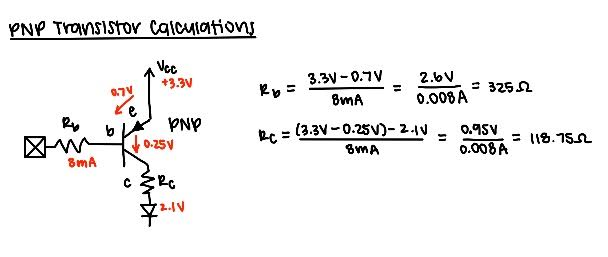
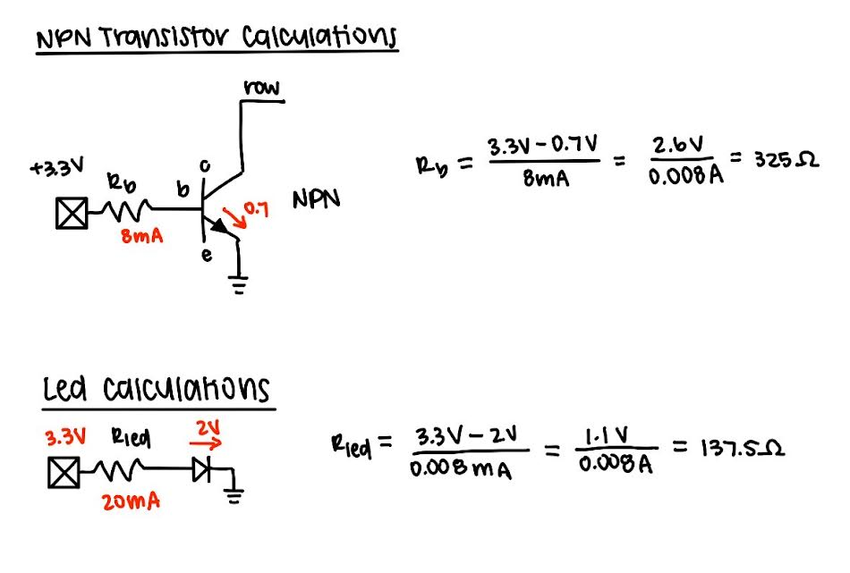
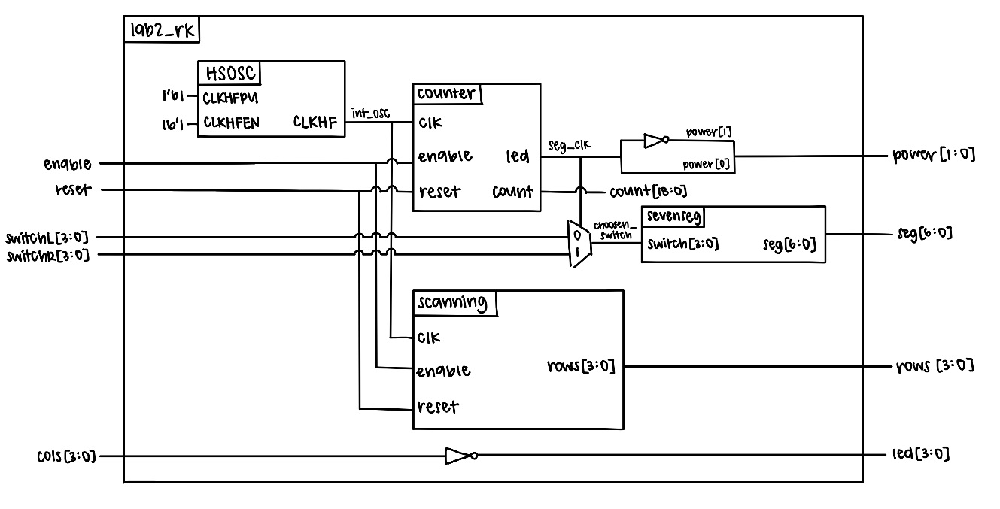
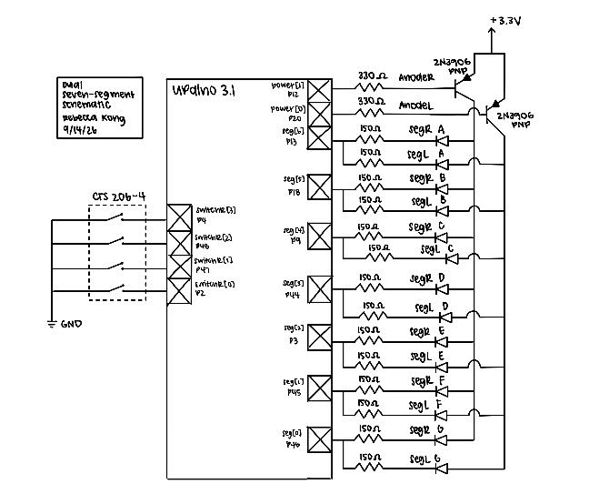
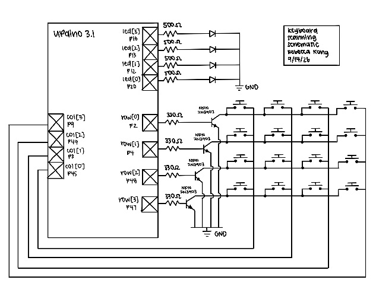
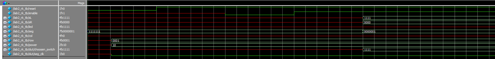
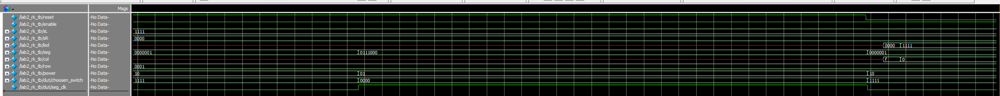
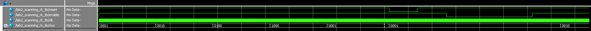

## Introduction
In this lab, SystemVerilog was used to implement a time-multiplexing scheme to drive two seven-segment displays with a single set of FPGA I/O pins and a keypad was installed with specified logic signals. The seven-segment displays were powered by two dip switches and a alternating flashing frequency that made both segments appear to be on at the same time. The keyboard used a scanner circuit that rotated between four states and lit up leds based on corresponding button presses.

## Design and Testing Methodology
#### Dual Seven-Segment Implementation
Our goal was to display two independent hexadecimal numbers on our dual seven-segment displays at the same time while only using one seven-segment decoder module to drive the cathodes of both displays. 

Essentially, we had to find a way to drive the two different switch inputs into the two different segmenets in a way that alternates between the two fast enough to make the display appear to have both numbers on at the same time. To ensure enough power was supplied to a given anode, we used 3N3906 PNP transistors to ensure a large enough current was driven to the annode. Based on these expected current we preformed some PNP transistor calculations

Previous submodules counter and seven-segment display (which outputs the corresponding segments based on switch input) were used. The 48MHz HSOSC clock was lowered to 120Hz, fast enough to trick the human eye but slow enough so the segmenets didn't bleed, and the seven-segment submodule was used to output the correct hex digits to the displays. This clock determined both which anode would be powered between the two segments as well as which seven-segment logic to display through the use of a multiplexer. 

#### 4x4 Keyboard Implementation
A new module known as the scanning module was created to scan through the rows of the keyboard by parsing through different states (each setting a specific row to high). These row outputs were checked based on this scanning module. 
In the top module, the button pushing logic and corresponding led response was implemented. All the columns were set to be high through pull up resistors, where when a row was high and a button was pushed at the same time, this would pull the column to low--through the use of a NPN 2N30903 transistor, making it so that when a row was high and a column was low at the same time, it indicates a button was pressed. This button input was then connected to an LED to display the pressing mechanism between columns as the scanner module scanned through the rows. There was also enable and reset input implemented into the code.

These two features were built on seperate breadboards with seperate pin assigmenents as the limited pins on the FPGA did not allow for both features to be displayed at once. 

#### Testbench Design
Testbenches were created for each of the three modules to verify that the design was functioning as expected. The submodule testbenches used assertions to check that the output of each module matched the expected output for a given input with the 7-segment module covering all input-output pairs and the counter showing that reset, enable, and max count features all worked correctly. The top level module testbench was used to verify that the submodules were connected correctly, the HSOSC worked, and that the switch-to-LED logic was functioning as expected.

#### Hardware Testing
The dual 7-segment display circuit was built and assigned GPIO pins along with a current-limiting resistor following a PNP transistor which was calculated in Figure 1.

::: {.callout-note collapse="true"}
## PNP Transitor Resistor Calculation

:::

The keyboard scanner circuit was also built and assigned GPIO pins but with a current-limited reistor that followed an NPN transistor calculated in Figure2.

::: {.callout-note collapse="true"}
## NPN Transitor Resistor Calculation

:::

## Technical Documentation
The source code for the project can be found in the associated [GitHub repository](https://github.com/rlxkong/E155-Lab2/tree/main/fpga/code).

### Block Diagram
::: {.callout-note collapse="true"}
## Block Diagram

:::
The block diagram in Figure 3 demonstrates the overall architecture of the design. The top-level module includes four submodules: the high-speed oscillator (HSOSC), the switch-to-seven-segment logic module,  the counter logic module, and the scanning module. It also contains the powering and selecting of the segment display and keyboard to LED logic.

### Schematic
::: {.callout-note collapse="true"}
## Schematic

:::
Figure 4 shows the schematic of the dual 7-segment physical circuit. The dual 7-segment display is connected to the labeled GPIO pins through a current-limiting resistor and powered through PNP transistors from the FPGA 3.3V supply.
Figure 5 shows the schematic of the keyboard scanning circuit. The keyboard is connected to the labeled GPIO pins and the row are connected via a resistor through a NPN transistor. The LEDs are also connected to GPIO pins with a 

## Results and Discussion
The design accomplished all of the design objectives.

### Testbench Simulation

Figure 6 show the successful simulation results of the top-level module testbench. This exercises the multiplexing and LED driving functionality.

::: {.callout-note collapse="true"}
## Top-Level Module Testbench Simulation

Figure 8 shows the successful simulation results of the scanning module testbench. The scanner is checked by verifying that all four output states are correct and reset and enable inputs work as expected.

::: {.callout-note collapse="true"}
## Counter Module Testbench Simulation

## Conclusion
The design succesfully implemented a time-multiplexing scheme to drive two seven-segment displays with a single set of FPGA I/O pins and installed a keypad that logic signals can pass through. I spent a total of around 20 hours working on this lab.

## AI Prototype Summary

::: {.callout-note collapse="true"}
## ChatGPT Generated Code Prompt 1
module seven_segment_mux (
    input  logic       clk,
    input  logic [3:0] digit0,
    input  logic [3:0] digit1,

    output logic [6:0] seg0,
    output logic [6:0] seg1
);

    logic       select;
    logic [3:0] decoder_input;
    logic [6:0] decoder_output;

    // Divide the clock to create the multiplexing rate.
    // Adjust COUNTER_MAX for the desired refresh frequency.
    localparam int COUNTER_MAX = 50_000;

    logic [$clog2(COUNTER_MAX)-1:0] counter;

    // Multiplex between the two 4-bit inputs.
    always_ff @(posedge clk) begin
        if (counter == COUNTER_MAX - 1) begin
            counter <= '0;
            select  <= ~select;
        end
        else begin
            counter <= counter + 1'b1;
        end
    end

    // Select which input is presented to the single decoder.
    always_comb begin
        if (select)
            decoder_input = digit1;
        else
            decoder_input = digit0;
    end

    // Single 4-bit to 7-segment decoder.
    // Common-anode display: 0 = segment ON, 1 = segment OFF.
    always_comb begin
        case (decoder_input)
            4'h0: decoder_output = 7'b1000000;
            4'h1: decoder_output = 7'b1111001;
            4'h2: decoder_output = 7'b0100100;
            4'h3: decoder_output = 7'b0110000;
            4'h4: decoder_output = 7'b0011001;
            4'h5: decoder_output = 7'b0010010;
            4'h6: decoder_output = 7'b0000010;
            4'h7: decoder_output = 7'b1111000;
            4'h8: decoder_output = 7'b0000000;
            4'h9: decoder_output = 7'b0010000;
            4'hA: decoder_output = 7'b0001000;
            4'hB: decoder_output = 7'b0000011;
            4'hC: decoder_output = 7'b1000110;
            4'hD: decoder_output = 7'b0100001;
            4'hE: decoder_output = 7'b0000110;
            4'hF: decoder_output = 7'b0001110;
            default: decoder_output = 7'b1111111;
        endcase
    end

    // Store the decoder result into the selected output.
    always_ff @(posedge clk) begin
        if (select)
            seg1 <= decoder_output;
        else
            seg0 <= decoder_output;
    end

endmodule

This code is somewhat similar to what I wrote in terms of logic of choosing which digit to display. It also has similar segment choosing logic and works well for displaying two numbers alternating on one display. 

:::
::: {.callout-note collapse="true"}
## ChatGPT Generated Code Prompt 2
//  lab1_sevenseg_mux_rk.sv
//  Rebecca Kong
//
//  Time-multiplexes one seven-segment decoder between two
//  4-bit inputs. The decoder drives a common-anode display,
//  so the segment outputs are active-low.
//
//  digit0 and digit1 are the two sets of seven segment outputs.
//  Only one set is enabled at a time, but switching occurs
//  rapidly enough that both displays appear continuously lit.

module lab1_sevenseg_mux_rk #(
    parameter integer MUX_COUNT = 10000
) (
    input  logic       reset,
    input  logic [3:0] switch0,
    input  logic [3:0] switch1,

    output logic [6:0] digit0,
    output logic [6:0] digit1
);

    // Internal high-speed oscillator
    logic int_osc;

    // Counter used to determine when to switch displays
    logic [$clog2(MUX_COUNT)-1:0] mux_count;

    // Selects which input is currently being decoded
    logic mux_select;

    // Input to the single seven-segment decoder
    logic [3:0] decoder_input;

    // Output of the single seven-segment decoder
    logic [6:0] decoder_output;

    //------------------------------------------------------------------
    // Internal high-speed oscillator
    //------------------------------------------------------------------
    HSOSC #(.CLKHF_DIV(2'b00))
        hf_osc (
            .CLKHFPU(1'b1),
            .CLKHFEN(1'b1),
            .CLKHF(int_osc)
        );

    //------------------------------------------------------------------
    // Multiplexing counter
    //------------------------------------------------------------------
    always_ff @(posedge int_osc) begin
        if (reset == 0) begin
            mux_count  <= '0;
            mux_select <= 1'b0;
        end
        else begin
            if (mux_count == MUX_COUNT - 1) begin
                mux_count  <= '0;
                mux_select <= ~mux_select;
            end
            else begin
                mux_count <= mux_count + 1'b1;
            end
        end
    end

    //------------------------------------------------------------------
    // Select which 4-bit input is sent to the ONE decoder
    //------------------------------------------------------------------
    always_comb begin
        if (mux_select == 1'b0)
            decoder_input = switch0;
        else
            decoder_input = switch1;
    end

    //------------------------------------------------------------------
    // Single seven-segment decoder
    //------------------------------------------------------------------
    lab1_sevenseg_rk sevenseg_decoder (
        .switch(decoder_input),
        .segments_abc_defg(decoder_output)
    );

    //------------------------------------------------------------------
    // Route decoder output to the selected display
    //
    // Because this is a common-anode display, the segment outputs
    // are active-low. A value of 0 turns a segment ON.
    //------------------------------------------------------------------
    always_comb begin

        // Default: both displays OFF
        digit0 = 7'b111_1111;
        digit1 = 7'b111_1111;

        if (mux_select == 1'b0)
            digit0 = decoder_output;
        else
            digit1 = decoder_output;

    end

endmodule
:::

The LLM-generated code is pretty good, however it did not use assign statements for things like the mux how I did. However, in theory most of the logic works the same way. Another thing it didn't do was decide when to output power as it doesn't assum the two anodes are driven to the same pin.
