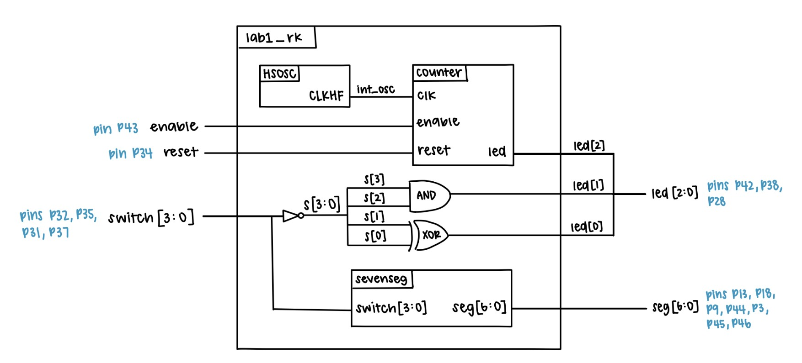
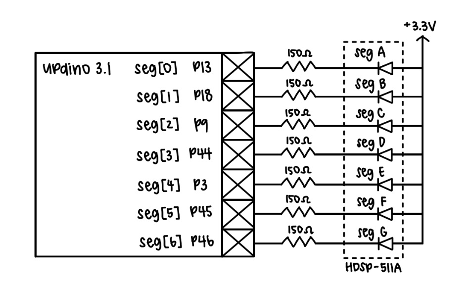
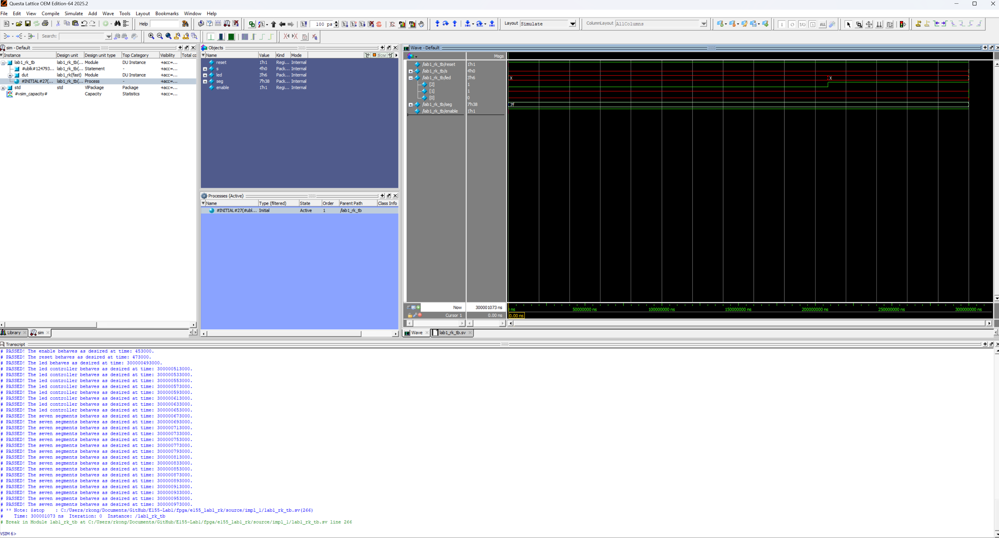
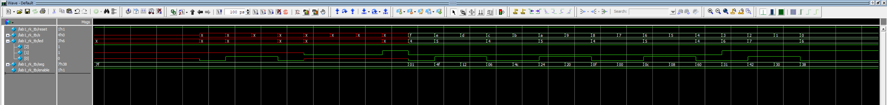
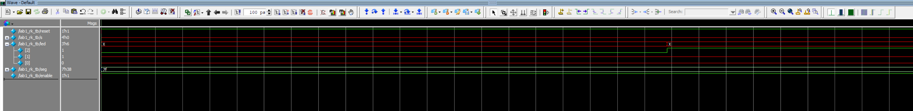
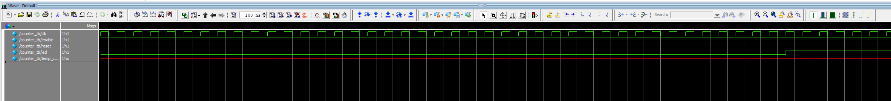
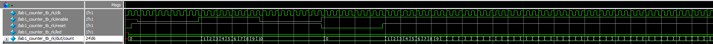
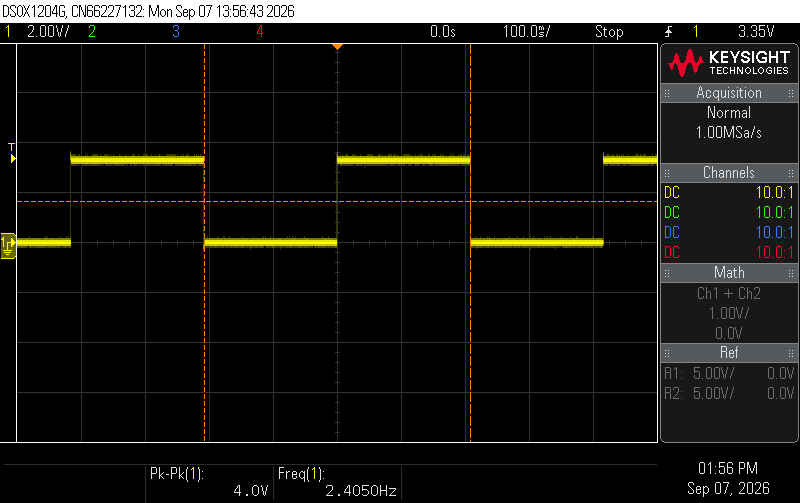
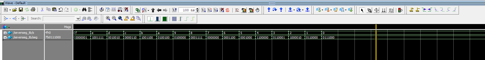

## Introduction
In this lab, SystemVerilog was used to implement a time-multiplexing scheme to drive two seven-segment displays with a single set of FPGA I/O pins and a keypad was installed with specified logic signals. The seven-segment displays were powered by two dip switches and a alternating flashing frequency that made both segments appear to be on at the same time. The keyboard used a scanner circuit that rotated between four states and lit up leds based on corresponding button presses.

## Design and Testing Methodology
#### Dual Seven-Segment Implementation
Our goal was to display two independent hexadecimal numbers on our dual seven-segment displays at the same time while only using one seven-segment decoder module to drive the cathodes of both displays. 

Essentially, we had to find a way to drive the two different switch inputs into the two different segmenets in a way that alternates between the two fast enough to make the display appear to have both numbers on at the same time. To ensure enough power was supplied to a given anode, we used 3N3906 PNP transistors to ensure a large enough current was driven to the annode. Based on these expected current we preformed some PNP transistor calculations

Previous submodules counter and seven-segment display (which outputs the corresponding segments based on switch input) were used. The 48MHz HSOSC clock was lowered to 120Hz, fast enough to trick the human eye but slow enough so the segmenets didn't bleed, and the seven-segment submodule was used to output the correct hex digits to the displays. This clock determined both which anode would be powered between the two segments as well as which seven-segment logic to display through the use of a multiplexer. 

#### 4x4 Keyboard Implementation
A new module known as the scanning module was created to scan through the rows of the keyboard by parsing through different states (each setting a specific row to high). These row outputs were checked based on this scanning module. 
In the top module, the button pushing logic and corresponding led response was implemented. All the columns were set to be high through pull up resistors, where when a row was high and a button was pushed at the same time, this would pull the column to low--through the use of a NPN 2N30903 transistor, making it so that when a row was high and a column was low at the same time, it indicates a button was pressed. This button input was then connected to an LED to display the pressing mechanism between columns as the scanner module scanned through the rows. There was also enable and reset input implemented into the code.

These two features were built on seperate breadboards with seperate pin assigmenents as the limited pins on the FPGA did not allow for both features to be displayed at once. 

#### Testbench Design
Testbenches were created for each of the three modules to verify that the design was functioning as expected. The submodule testbenches used assertions to check that the output of each module matched the expected output for a given input with the 7-segment module covering all input-output pairs and the counter showing that reset, enable, and max count features all worked correctly. The top level module testbench was used to verify that the submodules were connected correctly, the HSOSC worked, and that the switch-to-LED logic was functioning as expected.

#### Hardware Testing
The dual 7-segment display circuit was built and assigned GPIO pins along with a current-limiting resistor following a PNP transistor which was calculated in Figure 1.

::: {.callout-note collapse="true"}
## PNP Transitor Resistor Calculation

:::

The keyboard scanner circuit was also built and assigned GPIO pins but with a current-limited reistor that followed an NPN transistor calculated in Figure2.
::: {.callout-note collapse="true"}
## PNP Transitor Resistor Calculation

:::

## Technical Documentation
The source code for the project can be found in the associated [GitHub repository](https://github.com/rlxkong/E155-Lab2/tree/main/fpga/code).

### Block Diagram
::: {.callout-note collapse="true"}
## Block Diagram

:::
The block diagram in Figure 3 demonstrates the overall architecture of the design. The top-level module includes four submodules: the high-speed oscillator (HSOSC), the switch-to-seven-segment logic module,  the counter logic module, and the scanning module. It also contains the powering and selecting of the segment display and keyboard to LED logic.

### Schematic
::: {.callout-note collapse="true"}
## Schematic

:::
Figure 4 shows the schematic of the dual 7-segment physical circuit. The dual 7-segment display is connected to the labeled GPIO pins through a current-limiting resistor and powered through PNP transistors from the FPGA 3.3V supply.
Figure 5 shows the schematic of the keyboard scanning circuit. The keyboard is connected to the labeled GPIO pins and the row are connected via a resistor through a NPN transistor. The LEDs are also connected to GPIO pins with a 

## Results and Discussion
The design accomplished all of the design objectives.

### Testbench Simulation

Figure 5 show the successful simulation results of the top-level module testbench. 

::: {.callout-note collapse="true"}
## Top-Level Module Testbench Simulation

:::

Figure 8 shows the successful simulation results of the counter module testbench. The counter is checked by verifying that the output changes state at the correct time based on the maxcount and that the reset and enable inputs work as expected.

::: {.callout-note collapse="true"}
## Counter Module Testbench Simulation

:::

Figure 11 shows the successful simulation results of the switch-to-seven-segment module testbench. The module is checked by verifying that the output matches the expected output for all input-output pairs.

::: {.callout-note collapse="true"}
## Switch-to-Seven-Segment Module Testbench Simulation

:::

## Conclusion
The design succesfully blinked an LED at 2.4 Hz, displayed the correct output on the 7-segment display based on the input from the switches, and displayed the correct output on the LEDs based on the input from the switches. I spent a total of around 30 hours working on this lab.

## AI Prototype Summary

::: {.callout-note collapse="true"}
## ChatGPT Generated Code Attempt 1
module top (
    output logic led
);

    // iCE40 UltraPlus internal high-frequency oscillator.
    // 24 MHz is one of the supported SB_HFOSC frequencies.
    logic clk;

    SB_HFOSC #(
        .CLKHF_DIV("0b00")       // 24 MHz
    ) hfosc (
        .CLKHFPU(1'b1),          // Power up oscillator
        .CLKHFEN(1'b1),          // Enable oscillator
        .CLKHF(clk)
    );

    // 24 MHz / 12,000,000 = 2 Hz
    // Toggle the LED every 0.5 s.
    localparam int unsigned HALF_PERIOD = 12_000_000;

    logic [$clog2(HALF_PERIOD)-1:0] counter;

    always_ff @(posedge clk) begin
        if (counter == HALF_PERIOD - 1) begin
            counter <= '0;
            led     <= ~led;
        end
        else begin
            counter <= counter + 1'b1;
        end
    end

endmodule
:::
::: {.callout-note collapse="true"}
## ChatGPT Generated Code Succesful Synthesis
module top (
    output logic led
);

    logic clk;

    // iCE40 UltraPlus internal high-speed oscillator.
    // Radiant primitive: HSOSC
    //
    // CLKHF_DIV:
    //   2'b00 = 48 MHz
    //   2'b01 = 24 MHz
    //   2'b10 = 12 MHz
    //   2'b11 =  6 MHz
    //
    HSOSC #(
        .CLKHF_DIV(2'b01)
    ) hfosc (
        .CLKHFPU(1'b1),
        .CLKHFEN(1'b1),
        .CLKHF(clk)
    );

    // 24 MHz clock.
    //
    // Toggle every 6,000,000 clocks:
    //
    //   6,000,000 / 24,000,000 = 0.25 seconds
    //
    // Thus:
    //   LED ON  = 0.25 s
    //   LED OFF = 0.25 s
    //   complete cycle = 0.5 s
    //   blink frequency = 2 Hz
    //
    localparam int unsigned HALF_PERIOD = 6_000_000;
    localparam int unsigned COUNTER_WIDTH = $clog2(HALF_PERIOD);

    logic [COUNTER_WIDTH-1:0] counter = '0;

    always_ff @(posedge clk) begin
        if (counter == HALF_PERIOD - 1) begin
            counter <= '0;
            led     <= ~led;
        end
        else begin
            counter <= counter + 1'b1;
        end
    end

endmodule
:::

The LLM-generated code is pretty good, with the general logic in how it approaches dividing the clock signal being very similar to what I did. However, the LLM-generated code had an error in its first attempt due to using the wrong internal osciallator of SB_HFOSC instead of HSOSC. After some prompting and providing greater context, the LLM was able to generate a correct version of the code that successfully synthesized. 
I do think its nice how throughly the LLM comments and explains the code and the calculations behind it. Therefore, given the user understands the task at hand and can provide sufficient context, the LLM can generate the code fairly succesfully and quickly. 