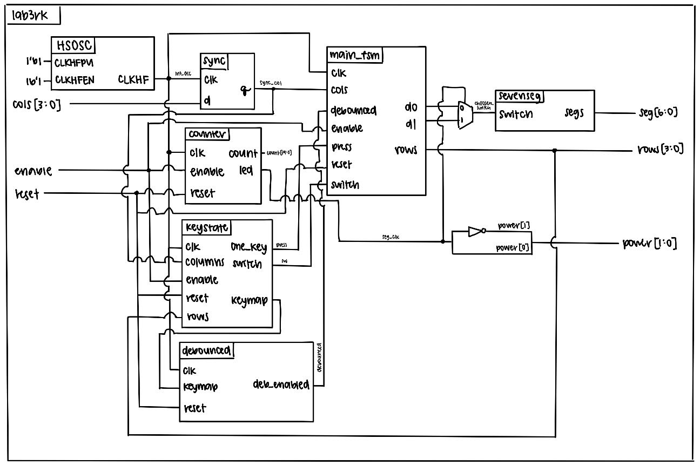
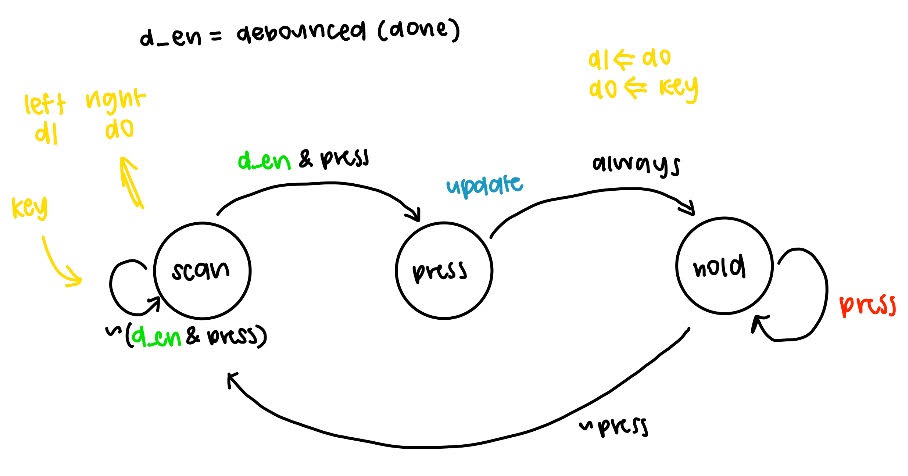
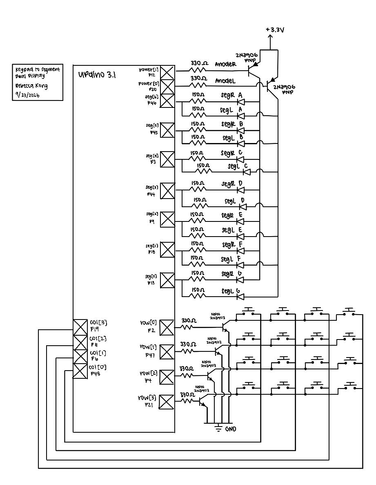
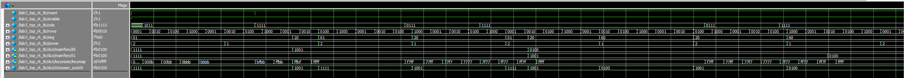
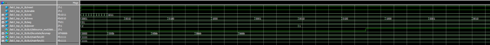
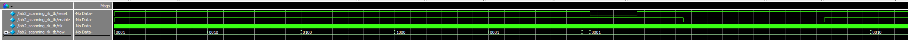
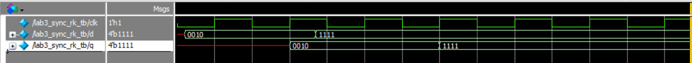
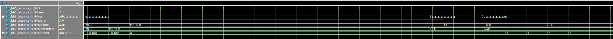
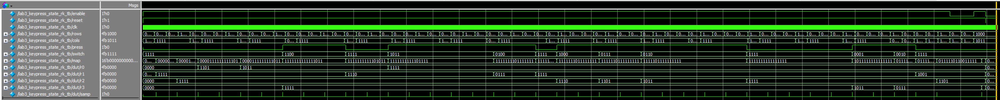
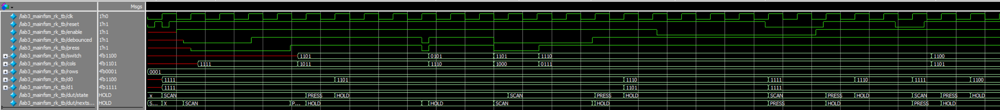

## Introduction
In this lab, SystemVerilog was used to implement a time-multiplexing scheme to drive two seven-segment displays with a single set of FPGA I/O pins and a keypad was installed with specified logic signals. The seven-segment displays were powered by two dip switches and a alternating flashing frequency that made both segments appear to be on at the same time. The keyboard used a scanner circuit that rotated between four states and lit up leds based on corresponding button presses.

## Design and Testing Methodology
#### Dual Seven-Segment Implementation
Our goal was to display two independent hexadecimal numbers on our dual seven-segment displays at the same time while only using one seven-segment decoder module to drive the cathodes of both displays. 

Essentially, we had to find a way to drive the two different switch inputs into the two different segmenets in a way that alternates between the two fast enough to make the display appear to have both numbers on at the same time. To ensure enough power was supplied to a given anode, we used 3N3906 PNP transistors to ensure a large enough current was driven to the annode. Based on these expected current we preformed some PNP transistor calculations

Previous submodules counter and seven-segment display (which outputs the corresponding segments based on switch input) were used. The 48MHz HSOSC clock was lowered to 120Hz, fast enough to trick the human eye but slow enough so the segmenets didn't bleed, and the seven-segment submodule was used to output the correct hex digits to the displays. This clock determined both which anode would be powered between the two segments as well as which seven-segment logic to display through the use of a multiplexer. 

#### 4x4 Keyboard Implementation
A new module known as the scanning module was created to scan through the rows of the keyboard by parsing through different states (each setting a specific row to high). These row outputs were checked based on this scanning module. 
In the top module, the button pushing logic and corresponding led response was implemented. All the columns were set to be high through pull up resistors, where when a row was high and a button was pushed at the same time, this would pull the column to low--through the use of a NPN 2N30903 transistor, making it so that when a row was high and a column was low at the same time, it indicates a button was pressed. This button input was then connected to an LED to display the pressing mechanism between columns as the scanner module scanned through the rows. There was also enable and reset input implemented into the code.

These two features were built on seperate breadboards with seperate pin assigmenents as the limited pins on the FPGA did not allow for both features to be displayed at once. 

#### Testbench Design
Testbenches were created for each of the three modules to verify that the design was functioning as expected. The submodule testbenches used assertions to check that the output of each module matched the expected output for a given input with the 7-segment module covering all input-output pairs and the counter showing that reset, enable, and max count features all worked correctly. The top level module testbench was used to verify that the submodules were connected correctly, the HSOSC worked, and that the switch-to-LED logic was functioning as expected.

#### Hardware Testing
The dual 7-segment display circuit was built and assigned GPIO pins that were connected to a corresponding keypad.

## Technical Documentation
The source code for the project can be found in the associated [GitHub repository](https://github.com/rlxkong/E155-Lab3/tree/main/fpga).

### Block Diagram
::: {.callout-note collapse="true"}
## Block Diagram

:::
The block diagram in Figure 1 demonstrates the overall architecture of the design. The top-level module with the logic that connects all the submodules.

::: {.callout-note collapse="true"}
## FSM

:::
These are the FSMs.

### Schematic
::: {.callout-note collapse="true"}
## Schematic

:::
Figure 2 shows the schematic of the dual 7-segment physical circuit. The dual 7-segment display is connected to the labeled GPIO pins through a current-limiting resistor and powered through PNP transistors from the FPGA 3.3V supply.

## Results and Discussion
The design accomplished all of the design objectives.

### Testbench Simulation

Figure 3 show the successful simulation results of the top-level module testbench. This exercises the multiplexing and LED driving functionality.

::: {.callout-note collapse="true"}
## Top-Level Module Testbench Simulation

:::

Figure 4 shows the successful simulation results of the scanning module testbench. The scanner is checked by verifying that all four output states are correct and reset and enable inputs work as expected. This is rechecked as I parameterized it this lab.

::: {.callout-note collapse="true"}
## Scanning Module Testbench Simulation

:::

Figure 5 shows the successful simulation results of the synchronizer.

::: {.callout-note collapse="true"}
## Synchronizer Module Testbench Simulation

:::

Figure 6 shows the successful simulation results of the debouncing module testbench. 

::: {.callout-note collapse="true"}
## Debouncing Module Testbench Simulation

:::

Figure 8 shows the successful simulation results of the keypress module testbench. 

::: {.callout-note collapse="true"}
## Keypress Module Testbench Simulation

:::

Figure 9 shows the successful simulation results of the mainfsm module testbench.

::: {.callout-note collapse="true"}
## MainFSM Module Testbench Simulation

:::

## Conclusion
The design succesfully implemented a time-multiplexing scheme to drive two seven-segment displays with a single set of FPGA I/O pins and installed a keypad that commands it. I spent a total of around 60-70 hours working on this lab.

## AI Prototype Summary

::: {.callout-note collapse="true"}
## ChatGPT Generated Code Prompt 1
module keypad_scanner #(
    parameter integer CLK_HZ  = 20_000_000,
    parameter integer SCAN_HZ = 1000
) (
    input  logic       clk,
    input  logic       reset,

    // Keypad interface
    // Columns are driven active-low.
    output logic [3:0] col,

    // Rows are read active-low.
    input  logic [3:0] row,

    // Key status and decoded key
    output logic       key_pressed,
    output logic [3:0] key_code
);

    //----------------------------------------------------------------------
    // Clock divider
    //
    // Generates a scan tick at approximately SCAN_HZ.
    //----------------------------------------------------------------------
    localparam integer DIVIDER =
        (CLK_HZ / SCAN_HZ);

    localparam integer DIV_WIDTH =
        (DIVIDER <= 2) ? 1 : $clog2(DIVIDER);

    logic [DIV_WIDTH-1:0] div_count;
    logic                 scan_tick;

    always_ff @(posedge clk) begin
        if (reset) begin
            div_count <= '0;
            scan_tick <= 1'b0;
        end
        else begin
            scan_tick <= 1'b0;

            if (div_count == DIVIDER - 1) begin
                div_count <= '0;
                scan_tick <= 1'b1;
            end
            else begin
                div_count <= div_count + 1'b1;
            end
        end
    end

    //----------------------------------------------------------------------
    // Scanner FSM
    //
    // DRIVE state:
    //   Select one column.
    //
    // SAMPLE state:
    //   Read the rows after the column has been driven for one scan tick.
    //
    // HOLD state:
    //   A key has been detected. Continue scanning, but do not register
    //   another key until all rows are released.
    //----------------------------------------------------------------------
    typedef enum logic [1:0] {
        ST_DRIVE,
        ST_SAMPLE,
        ST_HOLD
    } state_t;

    state_t state;

    logic [1:0] column_index;

    //----------------------------------------------------------------------
    // Temporary debounce/confirmation information.
    //
    // A candidate must be observed on two consecutive complete scans before
    // key_pressed is asserted. This provides basic debounce protection.
    //----------------------------------------------------------------------
    logic       candidate_valid;
    logic [3:0] candidate_code;

    logic [3:0] sampled_code;
    logic       sampled_valid;

    //----------------------------------------------------------------------
    // Decode the currently selected column and active-low row inputs.
    //
    // Only the first active row is used. This intentionally treats the
    // keypad as a single-key-at-a-time interface.
    //----------------------------------------------------------------------
    always_comb begin
        sampled_valid = 1'b0;
        sampled_code  = 4'h0;

        case (column_index)

            2'd0: begin
                if (!row[0]) begin
                    sampled_valid = 1'b1;
                    sampled_code  = 4'h1;
                end
                else if (!row[1]) begin
                    sampled_valid = 1'b1;
                    sampled_code  = 4'h4;
                end
                else if (!row[2]) begin
                    sampled_valid = 1'b1;
                    sampled_code  = 4'h7;
                end
                else if (!row[3]) begin
                    sampled_valid = 1'b1;
                    sampled_code  = 4'hE;   // *
                end
            end

            2'd1: begin
                if (!row[0]) begin
                    sampled_valid = 1'b1;
                    sampled_code  = 4'h2;
                end
                else if (!row[1]) begin
                    sampled_valid = 1'b1;
                    sampled_code  = 4'h5;
                end
                else if (!row[2]) begin
                    sampled_valid = 1'b1;
                    sampled_code  = 4'h8;
                end
                else if (!row[3]) begin
                    sampled_valid = 1'b1;
                    sampled_code  = 4'h0;
                end
            end

            2'd2: begin
                if (!row[0]) begin
                    sampled_valid = 1'b1;
                    sampled_code  = 4'h3;
                end
                else if (!row[1]) begin
                    sampled_valid = 1'b1;
                    sampled_code  = 4'h6;
                end
                else if (!row[2]) begin
                    sampled_valid = 1'b1;
                    sampled_code  = 4'h9;
                end
                else if (!row[3]) begin
                    sampled_valid = 1'b1;
                    sampled_code  = 4'hF;   // #
                end
            end

            2'd3: begin
                if (!row[0]) begin
                    sampled_valid = 1'b1;
                    sampled_code  = 4'hA;
                end
                else if (!row[1]) begin
                    sampled_valid = 1'b1;
                    sampled_code  = 4'hB;
                end
                else if (!row[2]) begin
                    sampled_valid = 1'b1;
                    sampled_code  = 4'hC;
                end
                else if (!row[3]) begin
                    sampled_valid = 1'b1;
                    sampled_code  = 4'hD;
                end
            end

            default: begin
                sampled_valid = 1'b0;
                sampled_code  = 4'h0;
            end

        endcase
    end

    //----------------------------------------------------------------------
    // Column driver
    //
    // Exactly one column is asserted low.
    //----------------------------------------------------------------------
    always_comb begin
        case (column_index)
            2'd0: col = 4'b1110;
            2'd1: col = 4'b1101;
            2'd2: col = 4'b1011;
            2'd3: col = 4'b0111;

            default: col = 4'b1111;
        endcase
    end

    //----------------------------------------------------------------------
    // Main scanner FSM
    //----------------------------------------------------------------------
    always_ff @(posedge clk) begin
        if (reset) begin
            state          <= ST_DRIVE;
            column_index   <= 2'd0;

            candidate_valid <= 1'b0;
            candidate_code  <= 4'h0;

            key_pressed     <= 1'b0;
            key_code        <= 4'h0;
        end
        else if (scan_tick) begin

            case (state)

                //----------------------------------------------------------
                // Drive a column, then wait for the next scan tick.
                //----------------------------------------------------------
                ST_DRIVE: begin
                    state <= ST_SAMPLE;
                end

                //----------------------------------------------------------
                // Sample the rows for the currently active column.
                //----------------------------------------------------------
                ST_SAMPLE: begin

                    if (sampled_valid) begin

                        // First observation of a key.
                        if (!candidate_valid) begin
                            candidate_valid <= 1'b1;
                            candidate_code  <= sampled_code;
                        end

                        // Same key observed again: accept it.
                        else if (candidate_code == sampled_code) begin
                            key_pressed <= 1'b1;
                            key_code    <= sampled_code;

                            state <= ST_HOLD;
                        end

                        // Different key: restart debounce.
                        else begin
                            candidate_valid <= 1'b1;
                            candidate_code  <= sampled_code;
                        end

                    end
                    else begin
                        // No key in this column.
                        //
                        // Continue scanning the remaining columns.
                        candidate_valid <= 1'b0;

                        if (column_index == 2'd3) begin
                            column_index <= 2'd0;
                        end
                        else begin
                            column_index <= column_index + 1'b1;
                        end
                    end

                    // If the current column produced a key, remain on it
                    // for confirmation on the next scan tick.
                    if (sampled_valid) begin
                        state <= ST_SAMPLE;
                    end
                    else begin
                        state <= ST_DRIVE;
                    end
                end

                //----------------------------------------------------------
                // A key is being held.
                //
                // Do not accept another key until the keypad is completely
                // released.
                //----------------------------------------------------------
                ST_HOLD: begin

                    if (!sampled_valid) begin
                        // This column is released. Continue through the
                        // remaining columns to make sure no other key is
                        // still pressed.
                        if (column_index == 2'd3) begin
                            key_pressed    <= 1'b0;
                            candidate_valid <= 1'b0;
                            column_index   <= 2'd0;
                            state          <= ST_DRIVE;
                        end
                        else begin
                            column_index <= column_index + 1'b1;
                            state        <= ST_DRIVE;
                        end
                    end
                    else begin
                        // Key is still being held.
                        state <= ST_HOLD;
                    end
                end

                default: begin
                    state <= ST_DRIVE;
                end

            endcase
        end
    end

endmodule
:::
This code sythesized. 

::: {.callout-note collapse="true"}
## ChatGPT Generated Code Prompt 2 (Parts a,b,c)
module keypad_key_register (
    input  logic       clk,
    input  logic       reset,

    input  logic       key_valid,   // 1 = stable key is currently pressed
    input  logic [3:0] key_code,    // hexadecimal key code

    output logic [3:0] registered_key,
    output logic       new_key      // one-clock-cycle pulse
);

    typedef enum logic [1:0] {
        IDLE,        // Waiting for a key press
        REGISTER,    // Register the detected key
        WAIT_RELEASE // Ignore input until all keys are released
    } state_t;

    state_t state;

    always_ff @(posedge clk) begin
        if (reset) begin
            state          <= IDLE;
            registered_key <= 4'h0;
            new_key        <= 1'b0;
        end
        else begin
            // Default: new_key is normally inactive.
            new_key <= 1'b0;

            case (state)

                IDLE: begin
                    if (key_valid) begin
                        state <= REGISTER;
                    end
                end

                REGISTER: begin
                    // Capture the key exactly once.
                    registered_key <= key_code;
                    new_key        <= 1'b1;

                    // Do not accept another key until release.
                    state <= WAIT_RELEASE;
                end

                WAIT_RELEASE: begin
                    if (!key_valid) begin
                        state <= IDLE;
                    end
                end

                default: begin
                    state <= IDLE;
                end

            endcase
        end
    end

endmodule

module keypad_scanner #(
    parameter integer CLK_HZ  = 20_000_000,
    parameter integer SCAN_HZ = 1000
) (
    input  logic       clk,
    input  logic       reset,

    // Keypad interface
    // Columns are driven active-low.
    output logic [3:0] col,

    // Rows are read active-low.
    input  logic [3:0] row,

    // Key status and decoded key
    output logic       key_pressed,
    output logic [3:0] key_code
);

    //----------------------------------------------------------------------
    // Clock divider
    //
    // Generates a scan tick at approximately SCAN_HZ.
    //----------------------------------------------------------------------
    localparam integer DIVIDER =
        (CLK_HZ / SCAN_HZ);

    localparam integer DIV_WIDTH =
        (DIVIDER <= 2) ? 1 : $clog2(DIVIDER);

    logic [DIV_WIDTH-1:0] div_count;
    logic                 scan_tick;

    always_ff @(posedge clk) begin
        if (reset) begin
            div_count <= '0;
            scan_tick <= 1'b0;
        end
        else begin
            scan_tick <= 1'b0;

            if (div_count == DIVIDER - 1) begin
                div_count <= '0;
                scan_tick <= 1'b1;
            end
            else begin
                div_count <= div_count + 1'b1;
            end
        end
    end

    //----------------------------------------------------------------------
    // Scanner FSM
    //
    // DRIVE state:
    //   Select one column.
    //
    // SAMPLE state:
    //   Read the rows after the column has been driven for one scan tick.
    //
    // HOLD state:
    //   A key has been detected. Continue scanning, but do not register
    //   another key until all rows are released.
    //----------------------------------------------------------------------
    typedef enum logic [1:0] {
        ST_DRIVE,
        ST_SAMPLE,
        ST_HOLD
    } state_t;

    state_t state;

    logic [1:0] column_index;

    //----------------------------------------------------------------------
    // Temporary debounce/confirmation information.
    //
    // A candidate must be observed on two consecutive complete scans before
    // key_pressed is asserted. This provides basic debounce protection.
    //----------------------------------------------------------------------
    logic       candidate_valid;
    logic [3:0] candidate_code;

    logic [3:0] sampled_code;
    logic       sampled_valid;

    //----------------------------------------------------------------------
    // Decode the currently selected column and active-low row inputs.
    //
    // Only the first active row is used. This intentionally treats the
    // keypad as a single-key-at-a-time interface.
    //----------------------------------------------------------------------
    always_comb begin
        sampled_valid = 1'b0;
        sampled_code  = 4'h0;

        case (column_index)

            2'd0: begin
                if (!row[0]) begin
                    sampled_valid = 1'b1;
                    sampled_code  = 4'h1;
                end
                else if (!row[1]) begin
                    sampled_valid = 1'b1;
                    sampled_code  = 4'h4;
                end
                else if (!row[2]) begin
                    sampled_valid = 1'b1;
                    sampled_code  = 4'h7;
                end
                else if (!row[3]) begin
                    sampled_valid = 1'b1;
                    sampled_code  = 4'hE;   // *
                end
            end

            2'd1: begin
                if (!row[0]) begin
                    sampled_valid = 1'b1;
                    sampled_code  = 4'h2;
                end
                else if (!row[1]) begin
                    sampled_valid = 1'b1;
                    sampled_code  = 4'h5;
                end
                else if (!row[2]) begin
                    sampled_valid = 1'b1;
                    sampled_code  = 4'h8;
                end
                else if (!row[3]) begin
                    sampled_valid = 1'b1;
                    sampled_code  = 4'h0;
                end
            end

            2'd2: begin
                if (!row[0]) begin
                    sampled_valid = 1'b1;
                    sampled_code  = 4'h3;
                end
                else if (!row[1]) begin
                    sampled_valid = 1'b1;
                    sampled_code  = 4'h6;
                end
                else if (!row[2]) begin
                    sampled_valid = 1'b1;
                    sampled_code  = 4'h9;
                end
                else if (!row[3]) begin
                    sampled_valid = 1'b1;
                    sampled_code  = 4'hF;   // #
                end
            end

            2'd3: begin
                if (!row[0]) begin
                    sampled_valid = 1'b1;
                    sampled_code  = 4'hA;
                end
                else if (!row[1]) begin
                    sampled_valid = 1'b1;
                    sampled_code  = 4'hB;
                end
                else if (!row[2]) begin
                    sampled_valid = 1'b1;
                    sampled_code  = 4'hC;
                end
                else if (!row[3]) begin
                    sampled_valid = 1'b1;
                    sampled_code  = 4'hD;
                end
            end

            default: begin
                sampled_valid = 1'b0;
                sampled_code  = 4'h0;
            end

        endcase
    end

    //----------------------------------------------------------------------
    // Column driver
    //
    // Exactly one column is asserted low.
    //----------------------------------------------------------------------
    always_comb begin
        case (column_index)
            2'd0: col = 4'b1110;
            2'd1: col = 4'b1101;
            2'd2: col = 4'b1011;
            2'd3: col = 4'b0111;

            default: col = 4'b1111;
        endcase
    end

    //----------------------------------------------------------------------
    // Main scanner FSM
    //----------------------------------------------------------------------
    always_ff @(posedge clk) begin
        if (reset) begin
            state          <= ST_DRIVE;
            column_index   <= 2'd0;

            candidate_valid <= 1'b0;
            candidate_code  <= 4'h0;

            key_pressed     <= 1'b0;
            key_code        <= 4'h0;
        end
        else if (scan_tick) begin

            case (state)

                //----------------------------------------------------------
                // Drive a column, then wait for the next scan tick.
                //----------------------------------------------------------
                ST_DRIVE: begin
                    state <= ST_SAMPLE;
                end

                //----------------------------------------------------------
                // Sample the rows for the currently active column.
                //----------------------------------------------------------
                ST_SAMPLE: begin

                    if (sampled_valid) begin

                        // First observation of a key.
                        if (!candidate_valid) begin
                            candidate_valid <= 1'b1;
                            candidate_code  <= sampled_code;
                        end

                        // Same key observed again: accept it.
                        else if (candidate_code == sampled_code) begin
                            key_pressed <= 1'b1;
                            key_code    <= sampled_code;

                            state <= ST_HOLD;
                        end

                        // Different key: restart debounce.
                        else begin
                            candidate_valid <= 1'b1;
                            candidate_code  <= sampled_code;
                        end

                    end
                    else begin
                        // No key in this column.
                        //
                        // Continue scanning the remaining columns.
                        candidate_valid <= 1'b0;

                        if (column_index == 2'd3) begin
                            column_index <= 2'd0;
                        end
                        else begin
                            column_index <= column_index + 1'b1;
                        end
                    end

                    // If the current column produced a key, remain on it
                    // for confirmation on the next scan tick.
                    if (sampled_valid) begin
                        state <= ST_SAMPLE;
                    end
                    else begin
                        state <= ST_DRIVE;
                    end
                end

                //----------------------------------------------------------
                // A key is being held.
                //
                // Do not accept another key until the keypad is completely
                // released.
                //----------------------------------------------------------
                ST_HOLD: begin

                    if (!sampled_valid) begin
                        // This column is released. Continue through the
                        // remaining columns to make sure no other key is
                        // still pressed.
                        if (column_index == 2'd3) begin
                            key_pressed    <= 1'b0;
                            candidate_valid <= 1'b0;
                            column_index   <= 2'd0;
                            state          <= ST_DRIVE;
                        end
                        else begin
                            column_index <= column_index + 1'b1;
                            state        <= ST_DRIVE;
                        end
                    end
                    else begin
                        // Key is still being held.
                        state <= ST_HOLD;
                    end
                end

                default: begin
                    state <= ST_DRIVE;
                end

            endcase
        end
    end

endmodule

module keypad_top #(
    parameter integer CLK_HZ = 20_000_000
) (
    input  logic       reset,

    // 4x4 keypad
    input  logic [3:0] row,
    output logic [3:0] col,

    // Two-digit seven-segment display
    output logic [6:0] seg,
    output logic [1:0] digit_en
);

    //----------------------------------------------------------------------
    // Internal oscillator
    //
    // For the iCE40 UP5K, the internal high-frequency oscillator can be
    // instantiated using SB_HFOSC. The exact primitive parameters can be
    // adjusted for the desired oscillator frequency.
    //----------------------------------------------------------------------
    logic clk;

    SB_HFOSC #(
        .CLKHF_DIV("0")
    ) hfosc_inst (
        .CLKHFPU(1'b1),
        .CLKHFEN(1'b1),
        .CLKHF(clk)
    );

    //----------------------------------------------------------------------
    // Keypad scanner
    //----------------------------------------------------------------------
    logic       key_pressed;
    logic [3:0] key_code;

    keypad_scanner #(
        .CLK_HZ  (CLK_HZ),
        .SCAN_HZ (1000)
    ) scanner_inst (
        .clk         (clk),
        .reset       (reset),

        .col         (col),
        .row         (row),

        .key_pressed (key_pressed),
        .key_code    (key_code)
    );

    //----------------------------------------------------------------------
    // One-shot key registration
    //----------------------------------------------------------------------
    logic       new_key;
    logic [3:0] registered_key;

    keypad_key_register key_register_inst (
        .clk            (clk),
        .reset          (reset),

        .key_valid      (key_pressed),
        .key_code       (key_code),

        .registered_key (registered_key),
        .new_key        (new_key)
    );

    //----------------------------------------------------------------------
    // Two-key history
    //
    // older_key       <= previous most-recent key
    // most_recent_key <= newly registered key
    //
    // The display is changed ONLY when new_key is asserted.
    //----------------------------------------------------------------------
    logic [3:0] older_key;
    logic [3:0] most_recent_key;

    always_ff @(posedge clk) begin
        if (reset) begin
            older_key       <= 4'h0;
            most_recent_key <= 4'h0;
        end
        else if (new_key) begin
            older_key       <= most_recent_key;
            most_recent_key <= registered_key;
        end
    end

    //----------------------------------------------------------------------
    // Seven-segment decoder
    //
    // One decoder is shared between the two digits.
    //----------------------------------------------------------------------
    logic [6:0] decoded_segments;
    logic [3:0] selected_digit;

    sevenSegment seven_segment_inst (
        .digit    (selected_digit),
        .segments (decoded_segments)
    );

    //----------------------------------------------------------------------
    // Display multiplexing clock enable
    //
    // 1 kHz digit switching means:
    //
    //       digit 0 -> 1 ms
    //       digit 1 -> 1 ms
    //
    // giving approximately 500 Hz complete-display refresh.
    //----------------------------------------------------------------------
    localparam integer MUX_HZ = 1000;

    localparam integer MUX_DIV =
        CLK_HZ / MUX_HZ;

    localparam integer MUX_WIDTH =
        (MUX_DIV <= 2) ? 1 : $clog2(MUX_DIV);

    logic [MUX_WIDTH-1:0] mux_count;
    logic                 mux_tick;
    logic                 mux_select;

    always_ff @(posedge clk) begin
        if (reset) begin
            mux_count  <= '0;
            mux_tick   <= 1'b0;
        end
        else begin
            mux_tick <= 1'b0;

            if (mux_count == MUX_DIV - 1) begin
                mux_count <= '0;
                mux_tick  <= 1'b1;
            end
            else begin
                mux_count <= mux_count + 1'b1;
            end
        end
    end

    //----------------------------------------------------------------------
    // Digit selection
    //----------------------------------------------------------------------
    always_ff @(posedge clk) begin
        if (reset) begin
            mux_select <= 1'b0;
        end
        else if (mux_tick) begin
            mux_select <= ~mux_select;
        end
    end

    //----------------------------------------------------------------------
    // Select which key is sent to the seven-segment decoder.
    //
    // mux_select = 0 -> older key
    // mux_select = 1 -> most recent key
    //----------------------------------------------------------------------
    always_comb begin
        if (mux_select == 1'b0) begin
            selected_digit = older_key;
        end
        else begin
            selected_digit = most_recent_key;
        end
    end

    //----------------------------------------------------------------------
    // Seven-segment outputs
    //
    // Assumes an ACTIVE-LOW two-digit common-anode display:
    //
    //   digit_en[0] = left/older digit
    //   digit_en[1] = right/most-recent digit
    //----------------------------------------------------------------------
    always_comb begin
        seg = decoded_segments;

        if (mux_select == 1'b0) begin
            digit_en = 2'b10;     // enable older/left digit
        end
        else begin
            digit_en = 2'b01;     // enable recent/right digit
        end
    end

endmodule
:::

The LLM-generated code all synthesized.
