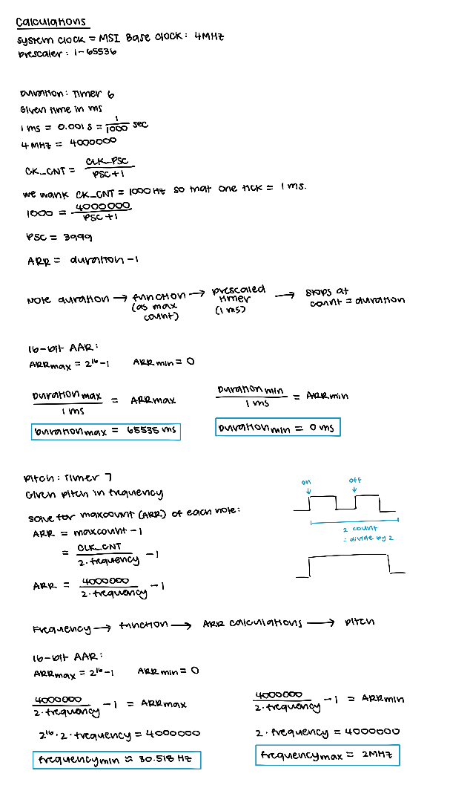
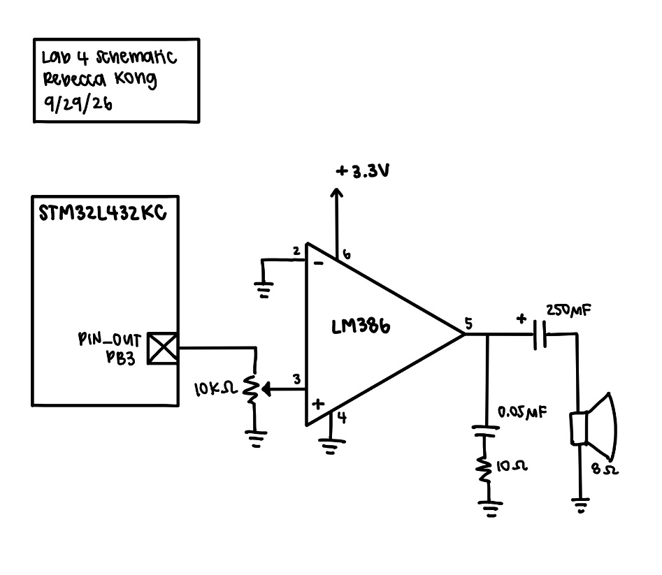

## Introduction
In this lab, we used our MCU to play Fur Elise by using timers to adjust frequencies based on information we found in the reference manual.

## Design and Testing Methodology
For this lab I used timers 6 and 7, which are basic timers. I used timer 6 to keep track of duration of a note and I used timer 7 to output the actual pitch of that note. 

For both timers I first wrote the driver that contains all the registers for each timer and then wrote corresponding functions that used the timers to be implemented. 

I wanted the frequency of Timer 6 to be 1 kHz so that the length would be equivalent to 1 ms. This is because the input values in durations is ms and therefore it would make setting the ARR (maxcount) easier. The calculations are shown below in Figure 1. As for Timer 7, the pitch, I needed to change the output frequency based on the frequency of the note input. Therefore, we calculate the ARR for each which is found using the caluclations below in Figure 1.

Figure 1: Calculations

[Frequency Error Validation Calculations for Fur Elise](https://docs.google.com/spreadsheets/d/1SPfb-ERGvry8uRksDVhdhcLMoouOa1QuLSDeLCNoNGY/edit?usp=sharing)

## Technical Documentation
The source code for the project can be found in the associated [GitHub repository](https://github.com/rlxkong/E155-Lab4).

### Schematic
::: {.callout-note collapse="true"}
## Schematic

:::
Figure 2 shows the schematic of the speaker MCU circuit.

## Results and Discussion
The design accomplished all of the design objectives. A majority of the lab was spent scanning through the datasheets and truly understanding the hardware before being able to implement the functionality into software. 

## Conclusion
The design succesfully played Fur Elise (and a song of my choosing). I was able to learn how to more efficiently locate items within a datasheet. I spent around 12 hours on this lab.

## AI Prototype Summary

::: {.callout-note collapse="true"}
## ChatGPT Reference Manual Scanning Reflection
I think that since LLMs scrape the internet for information, there is a lot of misinformation or mixups as it may refer to a different board that is similar based on things it finds on the web.

When directly attaching the reference manual, it is useful in terms of helping to scrape and find pages that may be relevant to the things that the user wants to find, however, the actual outputs may be inaccurate. Therefore, LLMs can be used to find information, however the user themself should be the one to actually look through and verify correct information. 
:::