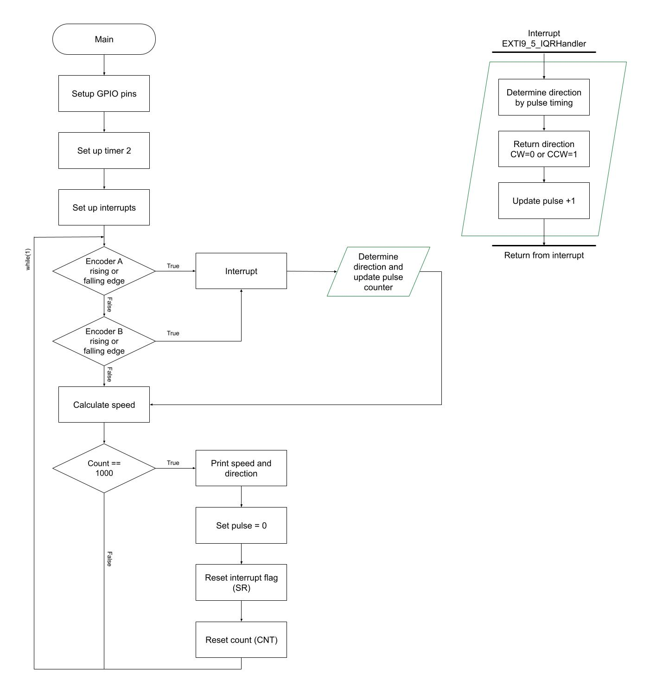
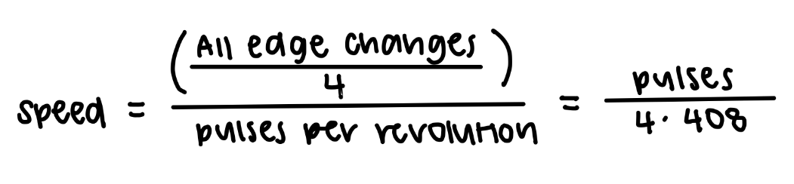
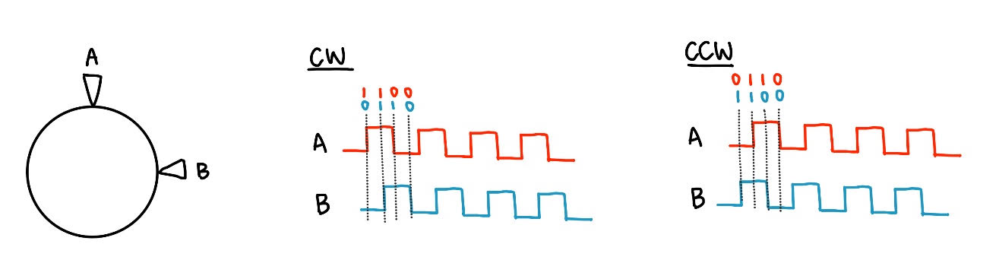
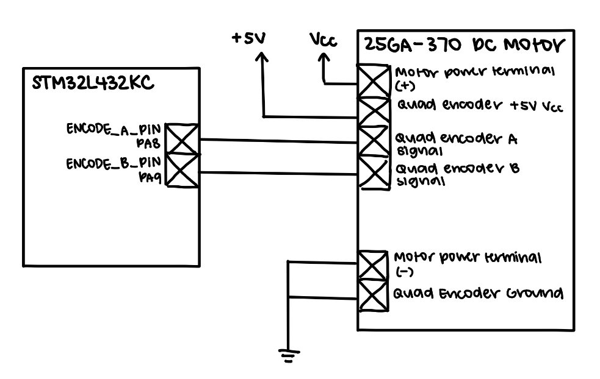
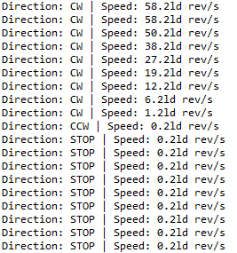

## Introduction
In this lab, we used interupts on our MCU to collect speed and direction of a turning motor based on quadrature encoder outputs. This information was then displayed to the user via printf statements.

## Design and Testing Methodology
This lab utalized a quadrature encoder to output signals that were used to detect the speed and direction of a motor. It has two stationary sensors that are 90 degrees out of phase which outputs pulses based on a magnetized disc. 

Therefore, since we want an "update" everytime the sensors pulse, we use interupts. The interrupt design can be referenced from the flow chart in Figure 1 below.

Figure 1: A flowchart to visualize the interrupt logic.

### Speed Logic
Since we know that out motors have 408 pulses per rotation, we were able to calculate the speed of our motor in revolutions per second by utalizing timer counts and number of pulses.

We have our timer running so that it runs at 10 kHz and counts till one second. We also trigger an interrupt every rising and falling edge of encoder A and encoder B. Therefore, we can calculate the speed as shown below in Figure 2. We have the count reset every second so that we can get the speed per a second.

Figure 2: Calculations to solve for motor speed.

### Direction Logic
Everytime the sensor pulses, an interrupt is triggered and we read the encoder pins--hence getting the status of each sensor. Each pin will read either 0 or 1, and since it triggers an interrupt only when there is a change, we can figure out what direction the motor is turning.

For example, if the interrupt is triggered by encoder A, we can see whether A is high or low. If A = 1, we know that A just became a rising edge. Therefore, if B = 0 at this time we know that A is leading and the motor is turning clockwise. On the other hand, if B = 1, then B is leading and the motor is turning counterclockwise. This logic can be seen in the diagram below (Figure 3).

Figure 3: Direction is determined by the pin that triggers the interrupt and the status of the pins relative to each other.

## Technical Documentation
The source code for the project can be found in the associated [GitHub repository](https://github.com/rlxkong/E155-Lab5).

### Schematic
::: {.callout-note collapse="true"}

:::
Figure 4 shows the schematic of the motor MCU circuit.

## Results and Discussion
The design accomplished all of the design objectives. A majority of the lab was spent scanning through the datasheets and understanding how the direction logic would work before being able to implement the functionality into software. 

### Polling vs. Interrupting
Polling constantly checks if the encoder outputs have changed, making it much faster than using interrupts. However, if the sampling rate is slower than the encoder signals, it could lead to aliasing behavior. Additionally, since it is constantly taking samples, it doesn't sample on pulse edges, making it not feasible for determining direction like how we did in this lab. On the other hand, interrupts enable the microcontroller to immediately respond to specific events, making it more accurate, and in this case, allowing us to find the direction of the motor.

## Conclusion
The design successfully output the speed and direction of the motor. This lab took me around 15 hours.

## AI Prototype Summary

::: {.callout-note collapse="true"}
## Initial ChatGPT Generated Code Prompt

#include "main.h"

volatile int32_t encoder_position = 0;

/*
 * Previous 2-bit encoder state:
 *
 *   bit 1 = Encoder B
 *   bit 0 = Encoder A
 */
static uint8_t encoder_previous_state = 0;

/*
 * Quadrature transition table.
 *
 * Index = (previous_state << 2) | current_state
 *
 * Valid transitions:
 *
 *   00 -> 01 -> 11 -> 10 -> 00  = clockwise
 *   00 -> 10 -> 11 -> 01 -> 00  = counter-clockwise
 *
 * Invalid transitions are ignored.
 */
static const int8_t quadrature_table[16] =
{
     0,  // 0000: 00 -> 00
    -1,  // 0001: 00 -> 01
     1,  // 0010: 00 -> 10
     0,  // 0011: 00 -> 11 (invalid)

     1,  // 0100: 01 -> 00
     0,  // 0101: 01 -> 01
     0,  // 0110: 01 -> 10 (invalid)
    -1,  // 0111: 01 -> 11

    -1,  // 1000: 11 -> 00 (invalid)
     0,  // 1001: 11 -> 01
     0,  // 1010: 11 -> 10
     1,  // 1011: 11 -> 11

     0,  // 1100: 10 -> 00
     1,  // 1101: 10 -> 01 (invalid)
    -1,  // 1110: 10 -> 10
     0   // 1111: 10 -> 11
};

/*
 * Call this whenever either encoder input changes.
 */
static void Encoder_Update(void)
{
    uint8_t A = HAL_GPIO_ReadPin(GPIOA, GPIO_PIN_0);
    uint8_t B = HAL_GPIO_ReadPin(GPIOA, GPIO_PIN_1);

    uint8_t current_state = (B << 1) | A;

    uint8_t index =
        (encoder_previous_state << 2) | current_state;

    encoder_position += quadrature_table[index];

    encoder_previous_state = current_state;
}

/*
 * STM32 HAL EXTI callback.
 *
 * This gets called whenever PA0 or PA1 changes state.
 */
void HAL_GPIO_EXTI_Callback(uint16_t GPIO_Pin)
{
    if (GPIO_Pin == GPIO_PIN_0 ||
        GPIO_Pin == GPIO_PIN_1)
    {
        Encoder_Update();
    }
}

/*
 * EXTI0 interrupt handler for PA0.
 */
void EXTI0_IRQHandler(void)
{
    HAL_GPIO_EXTI_IRQHandler(GPIO_PIN_0);
}

/*
 * EXTI1 interrupt handler for PA1.
 */
void EXTI1_IRQHandler(void)
{
    HAL_GPIO_EXTI_IRQHandler(GPIO_PIN_1);
}
:::

This code couldn't be built as it referenced pins/libraries that I didn't have. However, after a bit of prompting such as sharing what files the segger embedded project contained, changing pins to match my hardware, and telling it to directly display the speed and direction it gave the code below with these outputs.

::: {.callout-note collapse="true"}
## Further Prompted ChatGPT Generated Code
#include "stm32l432xx.h"
#include <stdint.h>
#include <stdio.h>

/* ============================================================
 * USER SETTINGS
 * ============================================================ */

/*
 * Encoder pulses per revolution.
 *
 * CHANGE THIS to match your encoder.
 *
 * Example:
 *
 *   20 PPR -> 20
 *   100 PPR -> 100
 *
 * We use x4 quadrature decoding, so:
 *
 *   counts/revolution = PPR * 4
 */
#define ENCODER_PPR        20

#define COUNTS_PER_REV     (ENCODER_PPR * 4)

/*
 * How often the speed is calculated.
 *
 * 100 ms = 0.1 seconds
 */
#define SPEED_UPDATE_MS    100

/* ============================================================
 * GLOBAL VARIABLES
 * ============================================================ */

/*
 * Current encoder position.
 *
 * This is modified inside the interrupt handler, so it must
 * be volatile.
 */
volatile int32_t encoder_count = 0;

/*
 * Previous A/B encoder state.
 *
 * Values:
 *
 * 0 = 00
 * 1 = 01
 * 2 = 10
 * 3 = 11
 */
volatile uint8_t encoder_state = 0;

/*
 * Millisecond system timer.
 */
volatile uint32_t system_ms = 0;

/* ============================================================
 * QUADRATURE LOOKUP TABLE
 * ============================================================ */

/*
 * The quadrature encoder has four possible states:
 *
 *
 *        B
 *        0   1
 *      +---+---+
 *    0 | 00| 01|
 *  A   +---+---+
 *    1 | 10| 11|
 *      +---+---+
 *
 *
 * One direction:
 *
 *     00 -> 01 -> 11 -> 10 -> 00
 *
 *
 * Other direction:
 *
 *     00 -> 10 -> 11 -> 01 -> 00
 *
 *
 * The table takes:
 *
 *     old state + new state
 *
 * and returns:
 *
 *     +1 = one direction
 *     -1 = other direction
 *      0 = no movement / invalid transition
 *
 *
 * Index = (old_state << 2) | new_state
 */
static const int8_t encoder_table[16] =
{
     0,  1, -1,  0,
    -1,  0,  0,  1,
     1,  0,  0, -1,
     0, -1,  1,  0
};

/* ============================================================
 * SYSTICK INTERRUPT
 * ============================================================ */

/*
 * Called every 1 millisecond.
 */
void SysTick_Handler(void)
{
    system_ms++;
}

/* ============================================================
 * INITIALIZE SYSTICK
 * ============================================================ */

static void SysTick_Init(void)
{
    /*
     * Configure SysTick for a 1 ms interrupt.
     */
    SysTick_Config(SystemCoreClock / 1000U);
}

/* ============================================================
 * READ ENCODER STATE
 * ============================================================ */

/*
 * Encoder wiring:
 *
 *     Encoder A -> PA8
 *     Encoder B -> PA9
 *
 *
 * Returns:
 *
 *     00 -> 0
 *     01 -> 1
 *     10 -> 2
 *     11 -> 3
 */
static uint8_t Encoder_ReadState(void)
{
    uint32_t pins;

    pins = GPIOA->IDR;

    /*
     * PA8 = Encoder A
     *
     * Put A into bit 1.
     */

    uint8_t A = (pins & (1U << 8)) ? 1 : 0;

    /*
     * PA9 = Encoder B
     *
     * Put B into bit 0.
     */

    uint8_t B = (pins & (1U << 9)) ? 1 : 0;

    return (A << 1) | B;
}

/* ============================================================
 * ENCODER INITIALIZATION
 * ============================================================ */

static void Encoder_Init(void)
{
    /*
     * --------------------------------------------------------
     * Enable GPIOA clock
     * --------------------------------------------------------
     */

    RCC->AHB2ENR |= RCC_AHB2ENR_GPIOAEN;

    /*
     * --------------------------------------------------------
     * Configure PA8 and PA9 as inputs.
     *
     * MODER:
     *
     * 00 = input
     * 01 = output
     * 10 = alternate function
     * 11 = analog
     * --------------------------------------------------------
     */

    GPIOA->MODER &= ~(
        (3U << (8 * 2)) |
        (3U << (9 * 2))
    );

    /*
     * --------------------------------------------------------
     * Enable internal pull-ups.
     *
     * PUPDR:
     *
     * 00 = no pull
     * 01 = pull-up
     * 10 = pull-down
     * --------------------------------------------------------
     */

    GPIOA->PUPDR &= ~(
        (3U << (8 * 2)) |
        (3U << (9 * 2))
    );

    GPIOA->PUPDR |= (
        (1U << (8 * 2)) |
        (1U << (9 * 2))
    );

    /*
     * --------------------------------------------------------
     * Configure EXTI8 and EXTI9.
     *
     * PA8 -> EXTI8
     * PA9 -> EXTI9
     *
     * Port A is the default EXTI source after reset.
     * --------------------------------------------------------
     */

    /*
     * Interrupt on rising edges.
     */

    EXTI->RTSR1 |=
        EXTI_RTSR1_RT8 |
        EXTI_RTSR1_RT9;

    /*
     * Interrupt on falling edges.
     */

    EXTI->FTSR1 |=
        EXTI_FTSR1_FT8 |
        EXTI_FTSR1_FT9;

    /*
     * Unmask EXTI8 and EXTI9.
     */

    EXTI->IMR1 |=
        EXTI_IMR1_IM8 |
        EXTI_IMR1_IM9;

    /*
     * Clear any pending interrupt flags.
     */

    EXTI->PR1 =
        EXTI_PR1_PIF8 |
        EXTI_PR1_PIF9;

    /*
     * --------------------------------------------------------
     * Enable EXTI9_5 interrupt in the NVIC.
     *
     * EXTI5, EXTI6, EXTI7, EXTI8 and EXTI9 share this handler.
     * --------------------------------------------------------
     */

    NVIC_SetPriority(EXTI9_5_IRQn, 2);

    NVIC_EnableIRQ(EXTI9_5_IRQn);

    /*
     * Get the initial encoder state.
     */

    encoder_state = Encoder_ReadState();
}

/* ============================================================
 * UPDATE ENCODER
 * ============================================================ */

static void Encoder_Update(void)
{
    uint8_t new_state;
    uint8_t index;
    int8_t movement;

    /*
     * Read current A/B state.
     */

    new_state = Encoder_ReadState();

    /*
     * Combine old and new states.
     */

    index = (encoder_state << 2) | new_state;

    /*
     * Look up the direction.
     *
     * +1 = clockwise
     * -1 = counter-clockwise
     *  0 = invalid/no movement
     */

    movement = encoder_table[index];

    /*
     * Update position.
     */

    encoder_count += movement;

    /*
     * Save the new state.
     */

    encoder_state = new_state;
}

/* ============================================================
 * EXTI INTERRUPT HANDLER
 *
 * PA8 -> EXTI8
 * PA9 -> EXTI9
 *
 * Both use EXTI9_5_IRQHandler().
 * ============================================================ */

void EXTI9_5_IRQHandler(void)
{
    /*
     * Check EXTI8 / PA8.
     */

    if (EXTI->PR1 & EXTI_PR1_PIF8)
    {
        /*
         * Clear interrupt flag.
         */

        EXTI->PR1 = EXTI_PR1_PIF8;

        /*
         * Decode encoder.
         */

        Encoder_Update();
    }

    /*
     * Check EXTI9 / PA9.
     */

    if (EXTI->PR1 & EXTI_PR1_PIF9)
    {
        /*
         * Clear interrupt flag.
         */

        EXTI->PR1 = EXTI_PR1_PIF9;

        /*
         * Decode encoder.
         */

        Encoder_Update();
    }
}

/* ============================================================
 * PRINT ENCODER STATUS
 * ============================================================ */

static void Encoder_PrintStatus(int32_t delta_count)
{
    int32_t speed_x100;

    /*
     * Calculate speed.
     *
     * We measure for 100 ms.
     *
     * 100 ms = 0.1 seconds
     *
     *
     * rev/s =
     *
     *       counts moved
     *       -------------
     *       counts/rev
     *       -------------
     *          0.1
     *
     *
     * To get two decimal places:
     *
     * speed_x100 =
     *
     *       delta_count * 10 * 100
     *       -----------------------
     *          counts/rev
     *
     *       = delta_count * 1000 / COUNTS_PER_REV
     */

    speed_x100 =
        (delta_count * 1000) /
        COUNTS_PER_REV;

    /*
     * Print direction.
     */

    printf("Direction: ");

    if (delta_count > 0)
    {
        printf("CW");
    }
    else if (delta_count < 0)
    {
        printf("CCW");

        /*
         * Make speed positive.
         *
         * Direction is displayed separately.
         */

        speed_x100 = -speed_x100;
    }
    else
    {
        printf("STOP");

        speed_x100 = 0;
    }

    /*
     * Print speed.
     *
     * Example:
     *
     *     Speed: 2.35 rev/s
     */

    printf(" | Speed: %ld.%02ld rev/s\r\n",
           (long)(speed_x100 / 100),
           (long)(speed_x100 % 100));
}

/* ============================================================
 * MAIN
 * ============================================================ */

int main(void)
{
    uint32_t last_update = 0;

    int32_t previous_count = 0;

    /*
     * --------------------------------------------------------
     * Initialize encoder.
     * --------------------------------------------------------
     */

    Encoder_Init();

    /*
     * --------------------------------------------------------
     * Initialize 1 ms timer.
     * --------------------------------------------------------
     */

    SysTick_Init();

    /*
     * --------------------------------------------------------
     * Startup message.
     * --------------------------------------------------------
     */

    printf("\r\n");
    printf("==============================\r\n");
    printf("Quadrature Encoder\r\n");
    printf("==============================\r\n");
    printf("Encoder PPR: %d\r\n", ENCODER_PPR);
    printf("Counts/rev:  %d\r\n", COUNTS_PER_REV);
    printf("Ready!\r\n\r\n");

    /*
     * --------------------------------------------------------
     * Main loop.
     * --------------------------------------------------------
     */

    while (1)
    {
        /*
         * Update speed every 100 ms.
         */

        if ((system_ms - last_update) >= SPEED_UPDATE_MS)
        {
            int32_t current_count;
            int32_t delta_count;

            /*
             * Record update time.
             */

            last_update = system_ms;

            /*
             * Read current encoder position.
             */

            current_count = encoder_count;

            /*
             * Calculate how many counts occurred during
             * the last 100 ms.
             */

            delta_count =
                current_count - previous_count;

            /*
             * Save current position for next measurement.
             */

            previous_count = current_count;

            /*
             * Print direction and speed.
             */

            Encoder_PrintStatus(delta_count);
        }
    }
}

:::
